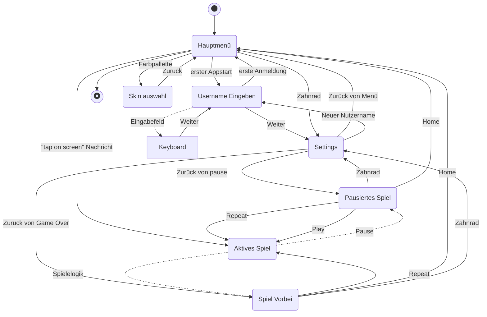

```mermaid
graph TD
    entry((fa:fa-circle))
    menu(Hauptmenü)
    settings(Settings)    
    signin(Username Eingeben)
    active(Aktives Spiel)
    paused(Pausiertes Spiel)
    ended(Spiel Vorbei)
    exit((fa:fa-circle-dot))
    skinselect(Skin auswahl)

    entry-->menu

    signin-->|erste Anmeldung|menu
    signin-->|Weiter|settings
    signin-.->|Eingabefeld|Keyboard
    Keyboard-->|Weiter|signin

    menu-->|erster Appstart|signin
    menu-->|Farbpallette|skinselect
    menu-->|Zahnrad|settings
    menu-->|"#quot;tap on screen#quot; Nachricht"|active
    menu-->exit

    settings-->|Zurück von Menü|menu
    settings-->|Zurück von pause|paused
    settings-->|Neuer Nutzername|signin
    settings-->|Zurück von Game Over|ended

    skinselect-->|Zurück|menu

    active-.->|Pause|paused
    active-.->|Spielelogik|ended

    paused-->|Repeat|active
    paused-->|Play|active
    paused-->|Zahnrad|settings
    paused-->|Home|menu

    ended-->|Repeat|active
    ended-->|Home|menu
    ended-->|Zahnrad|settings

```
