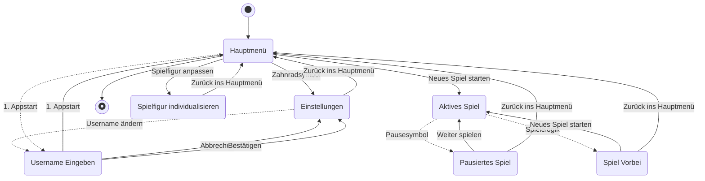

```mermaid
graph TD
    entry((fa:fa-circle))
    menu(Hauptmenü)
    settings(Einstellungen)    
    signin(Username Eingeben)
    active(Aktives Spiel)
    paused(Pausiertes Spiel)
    ended(Spiel Vorbei)
    exit((fa:fa-circle-dot))
    skinselect(Spielfigur individualisieren)

    entry-->menu
    menu-->exit

    menu-->|Zahnradsymbol|settings
    settings-.->|Username ändern|signin
    settings-->|Zurück ins Hauptmenü|menu

    menu-.->|1. Appstart|signin
    signin-->|1. Appstart|menu
    signin-->|Abbrechen|settings
    signin-->|Bestätigen|settings

    menu-->|Spielfigur anpassen|skinselect
    skinselect-->|Zurück ins Hauptmenü|menu

    menu-->|Neues Spiel starten|active
    active-.->|Pausesymbol|paused
    paused-->|Weiter spielen|active
    paused-->|Zurück ins Hauptmenü|menu
    active-.->|Spielelogik|ended
    ended-->|Neues Spiel starten|active
    ended-->|Zurück ins Hauptmenü|menu


```
