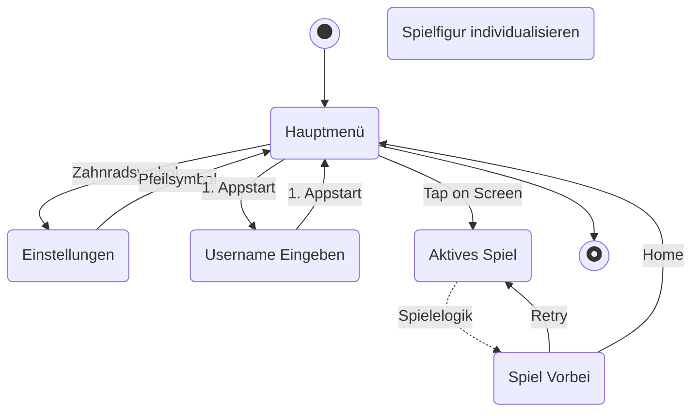

```mermaid
graph TD
    entry((fa:fa-circle))
    menu(Hauptmenü)
    settings(Einstellungen)    
    signin(Username Eingeben)
    active(Aktives Spiel)
    ended(Spiel Vorbei)
    exit((fa:fa-circle-dot))
    skinselect(Spielfigur individualisieren)

    entry-->menu
    menu-->exit

    menu-->|Zahnradsymbol|settings
    settings-->|Pfeilsymbol|menu

    menu-->|1. Appstart|signin
    signin-->|1. Appstart|menu


    menu-->|Tap on Screen|active
    active-.->|Spielelogik|ended
    ended-->|Retry|active
    ended-->|Home|menu


```
