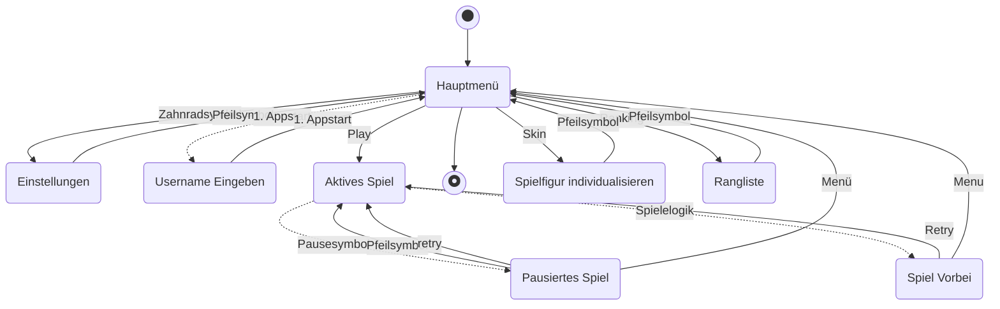

```mermaid
graph TD
    entry((fa:fa-circle))
    menu(Hauptmenü)
    settings(Einstellungen)    
    signin(Username Eingeben)
    active(Aktives Spiel)
    paused(Pausiertes Spiel)
    ended(Spiel Vorbei)
    exit((fa:fa-circle-dot))
    skinselect(Spielfigur individualisieren)
    ranking(Rangliste)

    entry-->menu
    menu-->exit

    menu-->|Ranking|ranking
    ranking-->|Pfeilsymbol|menu

    menu-->|Zahnradsymbol|settings
    settings-->|Pfeilsymbol|menu

    menu-.->|1. Appstart|signin
    signin-->|1. Appstart|menu

    menu-->|Skin|skinselect
    skinselect-->|Pfeilsymbol|menu

    menu-->|Play|active
    active-.->|Pausesymbol|paused
    paused-->|Pfeilsymbol|active
    paused-->|retry|active
    paused-->|Menü|menu
    active-.->|Spielelogik|ended
    ended-->|Retry|active
    ended-->|Menu|menu


```
