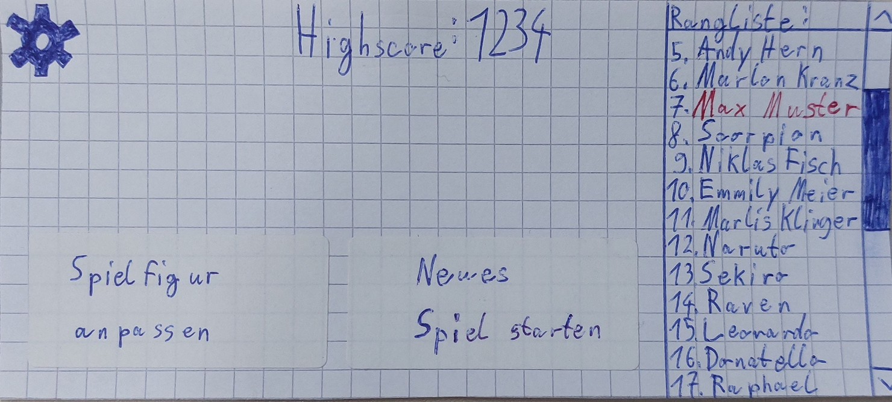
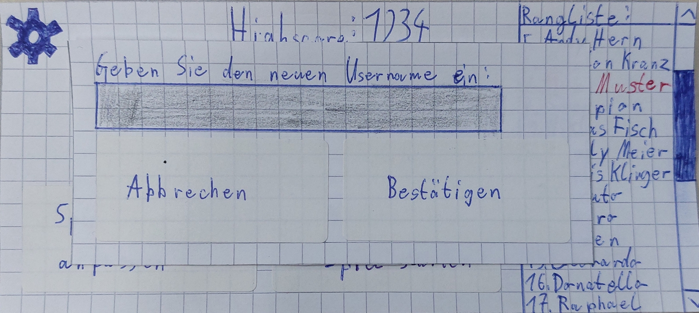
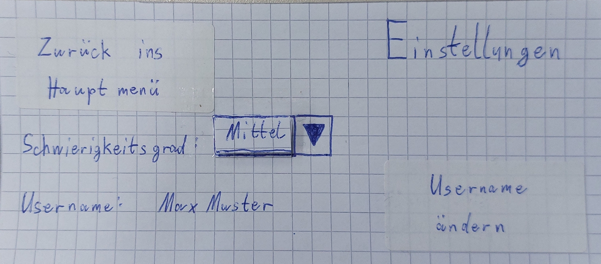
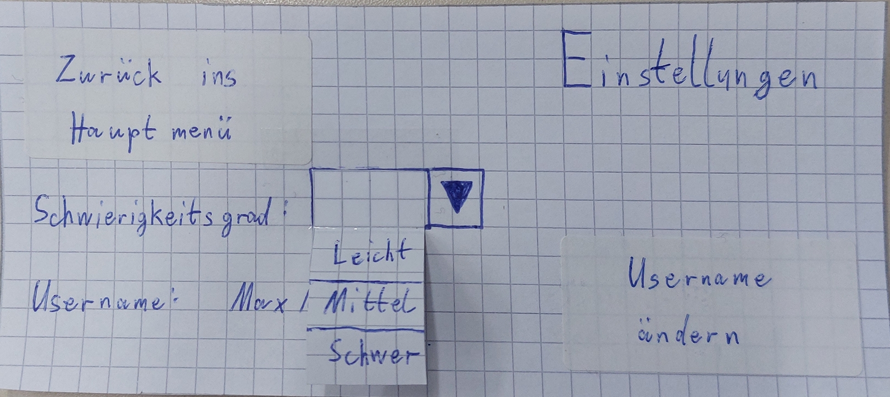
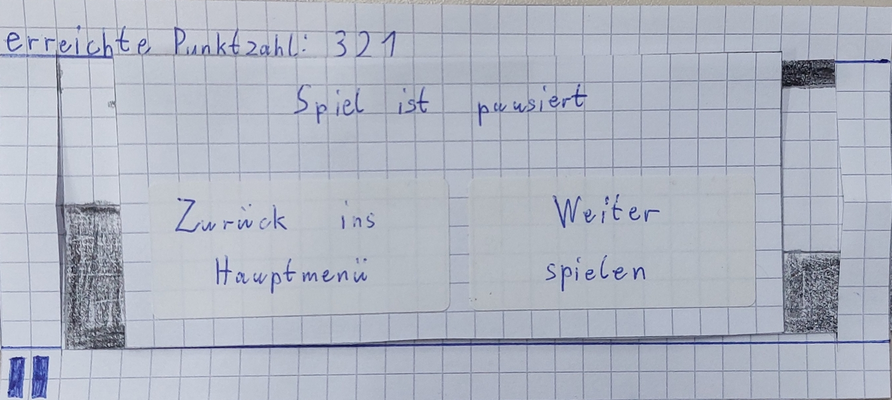
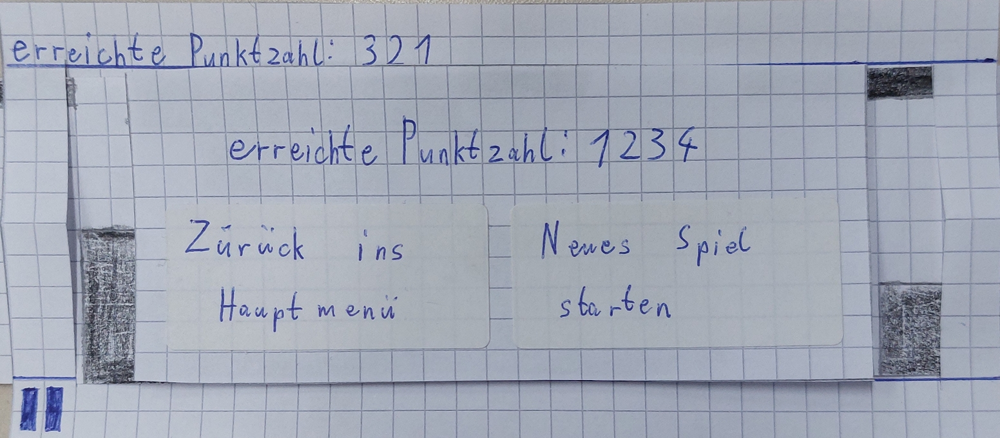

In allen Fenstern wurde auf folgendes geachtet:
- Die Buttons für "Zurück/Abbrechen" Funktionen sind auf der linken Seite angeordnet. Durch die Konsistenz soll dies die intuitive Bedienung fördern
- Der Anteil an Whitespace ist nicht zu hoch
- Möglichst wenig und selbsterklärender Text. Vorallem wichtig bei Buttons. Dies fördert die intuitive Bedienung.

**Hauptmenü:** 

Designentscheidung:
- Es wurde hier das Z-Shaped Scanning Pattern angewandt wobei die Online-Rangliste auf der rechten Seite die Ausnahme ist aber unsere Hypothese ist, dass der Nutzer dort durch das Z-Shaped Scanning Pattern liest dass dies die Online-Rangliste ist und somit erkennt dass die Liste darunter die entsprechende Rangliste ist.
- Das Icon links oben um in die Einstellungen zu navigieren ist ein Zahnrad. Dabei handelt es sich um ein "Reference Icon".
Das Zahnrad als Icon wurde ausgewählt da es fast überall für Einstellungen benutzt wird und somit hohen Wiedererkennungswert für die Nutzer bietet.
- Mittig oben ist eine Anzeige des aktuellen Highscores des Nutzers, dieser hat eine größere Schriftgröße da es sich um eine wichtige Information handelt.
- An der rechten Seite ist die Online-Rangliste mit Scrollbar, der eigene Username wird hervorgehoben durch andere Schriftfarbe.
- links unten ist der Button um ins Spielfigur_individualisieren Fenster zu navigieren, dieser wird durch das Z-Shaped Scanning Pattern vor dem Call-to-action Button gelesen damit der Nutzer die Spielfigur vorher ändern kann, wenn er dass möchte.
- Der "Neues Spiel starten" Button führt zum aktives_Spiel Fenster. Dieser ist absichtlich rechts unten da das Z-Shaped Scanning Pattern dort endet und es sich bei dem Button um den Call-to-action Button handelt 

**Username eingeben:**

Designentscheidung:
- Hierbei handelt es sich um ein Popup, zudem es 2 Möglichkeiten gibt hin zu navigieren. Erstens beim erstmaligem Starten der App öffnet sich das Popup automatisch im Hauptmenü. Zweite Möglichkeit ist durch einen Button im Einstellungen Fenster.
- Hier wurde Top-aligned Label angewandt für das Textfeld. In dem Textfeld wird der gewünschte Username eingetragen. Wenn man auf das Textfeld klickt öffnet sich die Tastatur des Handys weshalb die Tastatur nicht auf unserem Paper Prototype dargestellt wird. Desweiteren gibt es noch die Buttons um abzubrechen oder die Eingabe zu bestätigen.

**Einstellungen:**

Designentscheidung:
- Es wurde hier das Z-Shaped Scanning Pattern angewandt.
- rechts oben handelt es sich um eine statische Anzeige "Einstellungen" um zu verdeutlichen in welchem Fenster der Nutzer sich gerade befindet.
- rechts unten ist der Call-to-action Button um den Username zu ändern
- Bei dem Schwierigkeitsgrad kann der Nutzer in einem Dropdown Menü zwischen Leicht, Mittel und Schwer auswählen. Die Default Einstellung ist "Mittel". Die Schwierigkeitsgrade unterscheiden sich in der Geschwindigkeit der Spielfigur.

**Spielfigur individualisieren**

Designentscheidung:
- Auf der oberen Hälfte des Screens sieht man die Spielfigur mit dem Aussehen wobei die aktuell ausgewählte Spielfigur die an dem Dreieck in der Mitte ist. Zwischen den Skins kann der Nutzer mit "Wischen" wechseln wir gehen davon aus dass dies Intuitiv erkennbar ist und deshalb keine weitere Hilfestellung dafür vorhanden ist, dass wird sich in den User Tests herausstellen ob dies tatsächlich der Fall ist oder die Nutzer eine Hilfestellung benötigen wie z.b. ein Pfeil nach rechts und links.
- Wenn der Nutzer einen anderen Skin auswählen möchte muss er dies auch noch durch den Button "Bestätigen" bestätigen sonst ist weiterhin der alte Skin ausgewählt, ob der "aktive" Skin noch extra hervorgehoben werden muss wird sich ebenfalls in den User Tests herausstellen.

**Spiel aktiv:**

Designentscheidung:
- Oben links ist die dynamische Anzeige der aktuellen Punktzahl.
- unten links ist das Icon um in das Fenster "Spiel pausiert" zu navigieren. Dieses Icon wurde gewählt da es wie beim Zahnrad Icon im Hauptmenü sich um ein oft benutztes Icon für den entsprechenden Zweck handelt. In diesem Fall das Spiel zu pausieren.
- die aktuelle Punktzahl und das Pause Icon sind absichtlich auf der linken Seite da es sich bei dem Spiel um einen Sidescroller handelt indem die Landscape von rechts kommt, somit ist es wichtiger auf der rechten Seite des Bildschirms nur die Landscape zu sehen und nicht noch extra Anzeigen oder Buttons zu haben.

**Spiel pausiert:**

Designentscheidung:
- Es handelt sich um ein Popup.
- Es wurde das Z-Shaped Scanning Pattern angewandt mit dem Call-to-action Button "Weiter spielen".
- Es sind nur wenige Informationen auf dem Bildschirm da nicht mehr benötigt wird, dies verbessert die intuitive Bedienung.
- Oben mittig steht die wichtigste Information, dass das Spiel aktuell pausiert ist

**Spiel beendet:**

Designentscheidung:
- Es handelt sich um ein Popup.
- Es wurde das Z-Shaped Scanning Pattern angewandt mit dem call-to-action Button "Neues Spiel starten".
- Es sind nur wenige Informationen auf dem Bildschirm da nicht mehr benötigt wird, dies verbessert die intuitive Bedienung.
- Oben mittig steht die wichtigste Information, die erreichte Punktzahl.
