**Hauptmenü:** 

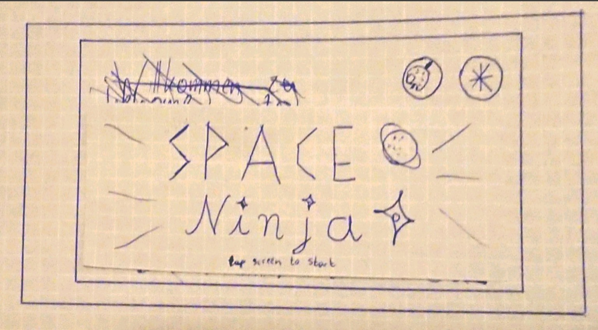
* Das Farbpalletten-Symbol wurde ausgewählt um intuitiv auf die Charakter Individualisierung zuzugreifen, da man mit Farbpaletten einen kreativen Prozess wie Gestaltung verbindet.
* Das Zahnrad-Symbol wurde für die Einstellungen verwendet, da es oftmals auch in anderen Bereichen für Einstellungen verwendet wird (external consistency)
* Das Logo für Space Ninja besteht aus 2 Fonts und 2 Symbolen
  * SPACE verwendet einen futuristisches Typeface und einen Planeten da Weltraum sich mit der modernen Themen verbinden lässt und Planeten sich im Weltraum befinden
  * Ninja ist in einem eher "flüssigen" Typeface geschrieben, der Ninjasterne als punkte verwendet und das Symbol ist ebenfalls ein Ninjastern, da man dies zum einen mit den flüssigen schleichbewegungen von Ninjas, sowie den traditionell mot Ninjas verbundenen Wurfsternen verbindet.
* die "tap screen to start" Nachricht befindet sich auf dem Bildschirm um dem Benutzer zu erklären, wie das Spiel zu starten ist ohne viel Platz des Bildschirms wegzunehmen.
Außerdem haben einige andere Spiele ähnliche Nachrichten (external consistency)

**Username eingeben:**

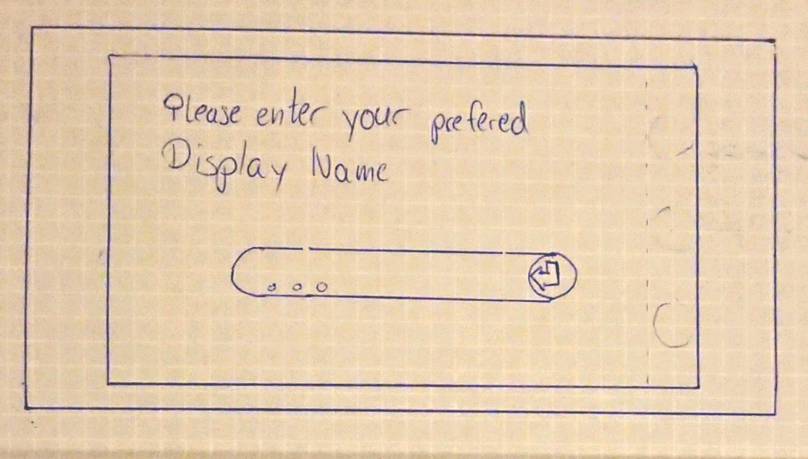
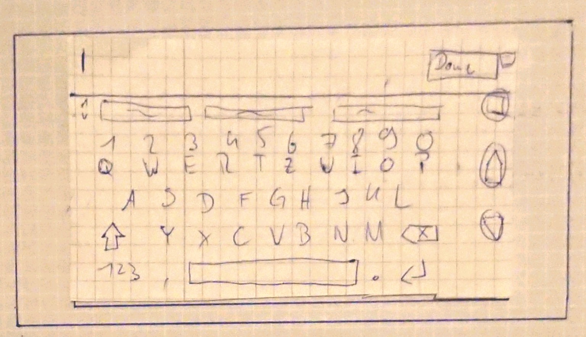
* die Abgerundeten Seiten des Einabefeldes wurden ausgewählt um fließend in den sich Rechts befindenden Bestätigungsbutton überzugehen.
* zum Bestätigen wurde ein Return-Symbol verwendet, da es bei den meisten Anwendungen bereits zum Vestätigen verwendet wird. (siehe Return Taste auf der Tastatur)
* die 3 Punkte symbolisieren, dass bisher kein Name eingegeben wurde. Sie wurden ausgewählt, da 3 Punkte auch in anderen Anwendungen verwendet werden, in denen mehr Eingabe erwartet oder ein leeres Feld angezeigt wird.
Im Gegensatz zu einem Bindestrich wird bei 3 Punkten allerdings erwartet eine Eingabe zu tätigen während ein Bindestrich verwendet wird um zu zeigen, dass keine Eingabe getätigt wurde.
* Die Tastatur ist die vom Android System verwendete Tastatur.
Da das Spiel ausschließlich im Landscape Modus verwendet werden soll. In diesem Modus sind aber Tastaturen traditionell über den gesammten Bildschirm.

**Einstellungen:**
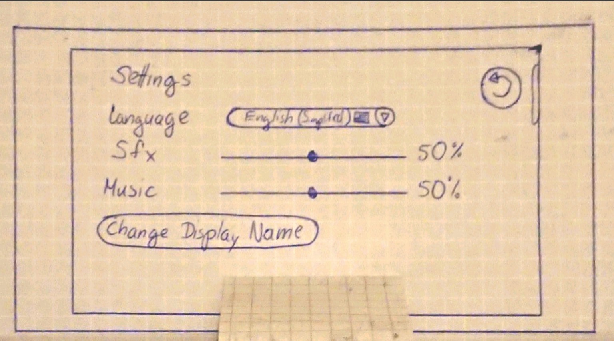
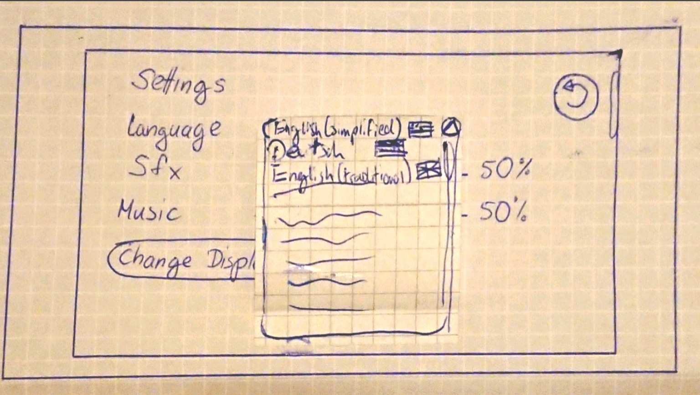
* Der Zurück Button ist durch einen Runden Pfeil in der rechten oberen Ecke gekennzeichnet, da an anderen Stellen bereits Pfeile dieser Art für "Zurück" verwendet wurden.
* Der Zurück Button is außerdem neben dem normalen Zurück Button des Systems da, da die System UI im Landscape Modus normalerweise nicht sichtbar ist und nur durch andere Aktionen sichtbar gemacht werden muss. Darum ist ein eigener zurück Button sinnvoll.
* die Sprachauswahl wurde in einem angerundeten Textfeld dargestellt, um intern konsistent mit der Eingabe des Nutzernamen ist.
* der Pfeil nach unten in der Sprachauswahl wurde gewählt, da dieser konsistent mit anderen Dropdown feldern ist.
Er ist in einem runden Button damit er mit dem angerundeten Textfeld harmoniert.
* im Dropdown wurde eine Scrollbar verwendet die Systemanhängig ist um extern konsistent mit anderen Android Apps zu sein.
* Die Slider für Soundeffekte und Musik sind abgerundet um mit dem generellen runden Theme der andern Kontrollflächen zu sein.
* Die Slider erhöhen ihren Wert nach Rechts, da das auch extern konsistent mit anderen Slidern ist. (rechts ist meistens mehr)
* Der Change Display Name Button ist in einem Angerundeten Feld, da andere Schaltflächen in der App auch abgerundet sind, während text keine runden Flächen um sich haben.

**Skin Auswahl**
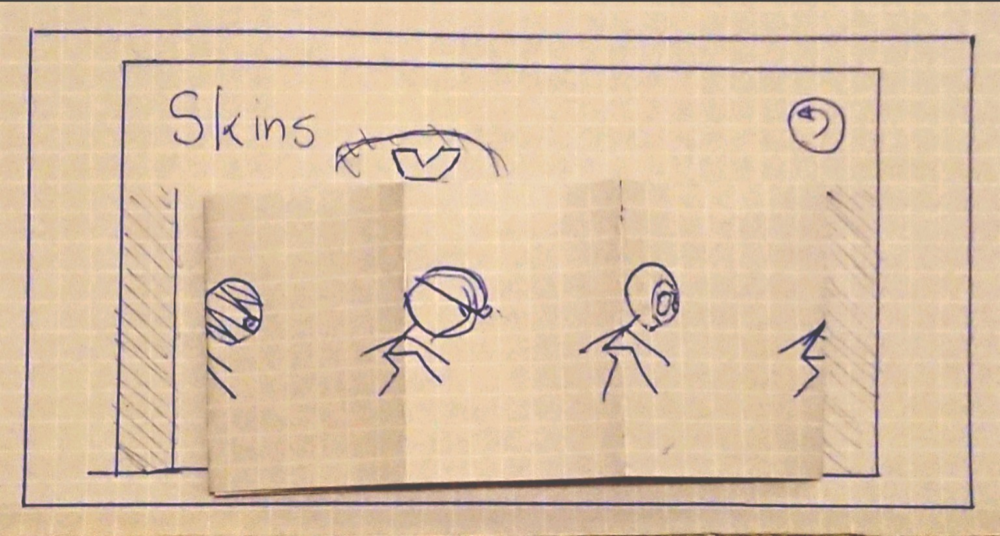
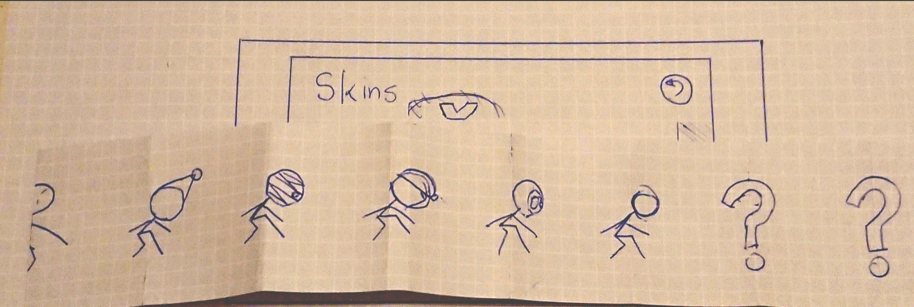
* Der Zurück Button ist durch einen Runden Pfeil in der rechten oberen Ecke gekennzeichnet, da an anderen Stellen bereits Pfeile dieser Art für "Zurück" verwendet wurden.
* Der Zurück Button is außerdem neben dem normalen Zurück Button des Systems da, da die System UI im Landscape Modus normalerweise nicht sichtbar ist und nur durch andere Aktionen sichtbar gemacht werden muss. Darum ist ein eigener zurück Button sinnvoll.
* Die Auswahl des Skins geschieht indem der momentan ausgerüstete Skin nach rechts oder links gezogen wird, was dadurch dargestellt ist, dass die Darstellungen an den Ecken der Darstellung nur halb angezeigt werden, was intuitiv dazu führt, dass man sieht dass es dort noch weiter geht.
* der Pfeil über der momentanen Auswahl stellt klar, was der momentan ausgewählte Skin ist.
Alternativ kann man auch den momentanen Skin vergrößern oder mit einem anderen Hintergrund darstellen (wegen Paper PRototype limitationen wurde hier ein Pfeil gewählt)

**Spiel aktiv:**

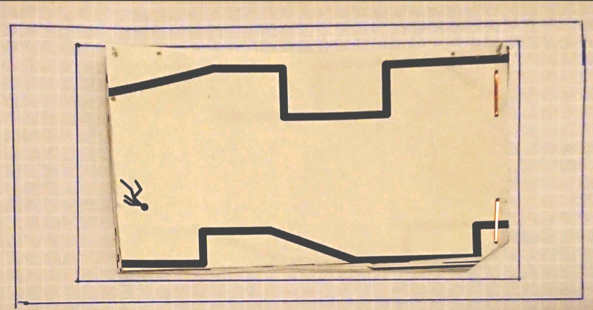
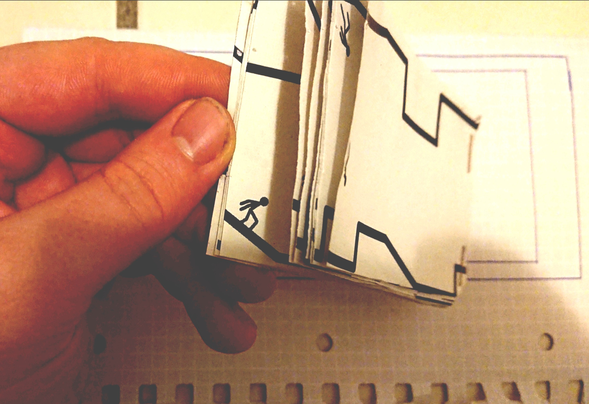

**Spiel pausiert:**
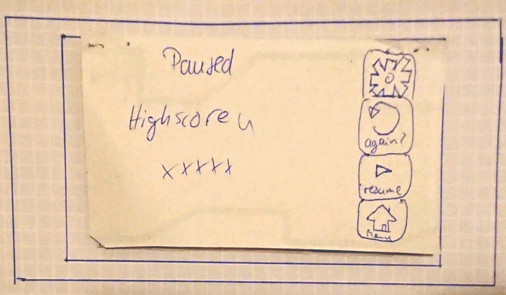
* Das Zahnrad Symbol symbolisiert wie im Menü auch die Einstellungen.
* die Schaltflächen sind mit einem erklärenden Text unterlegt, um das Kontrollschema klarzustellen, auch wenn die Symbole selbst schon recht eindeutig sind.
* Der Return Pfeil wird hier als "Restart" verwendet
* ein Pfeil nach Rechts wird hier als Weiter button verwendet, da dieses Symbol schon seit langer zeit für "Play" steht (schon an alten Kassettenspielern)
* das Haus wurde hier als Menübutton gewählt, weil diese Funktion in der Android UI fast komplett gleich verwendet wird. (external consistency)

**Spiel beendet:**
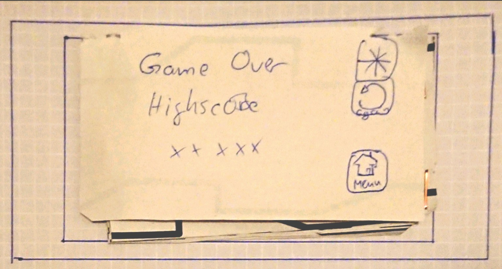
* Wie beim Pausebildschirm nur ohne Resume, da man ein verlorenes Spiel nicht weiterspielen kann.
