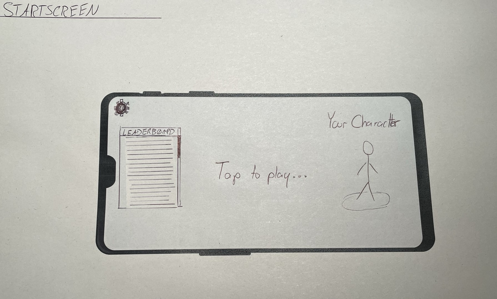
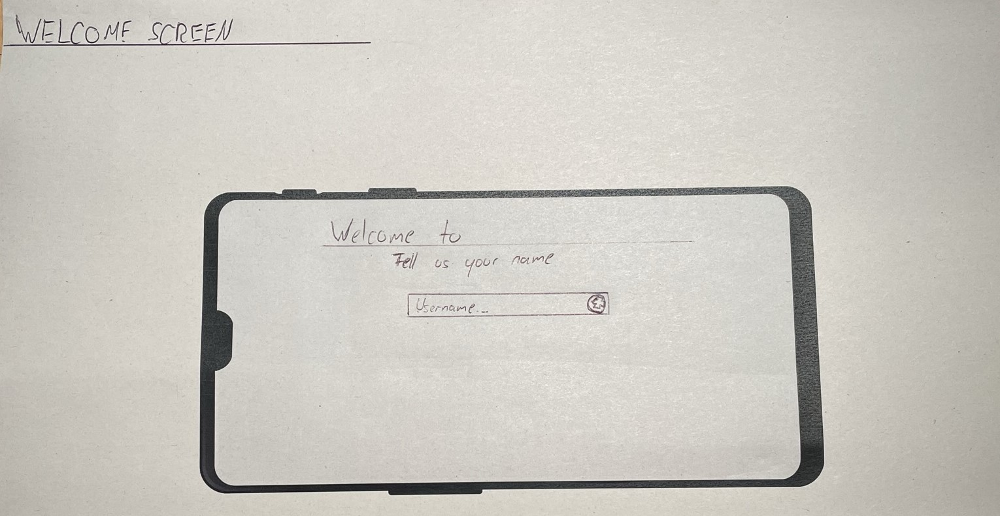
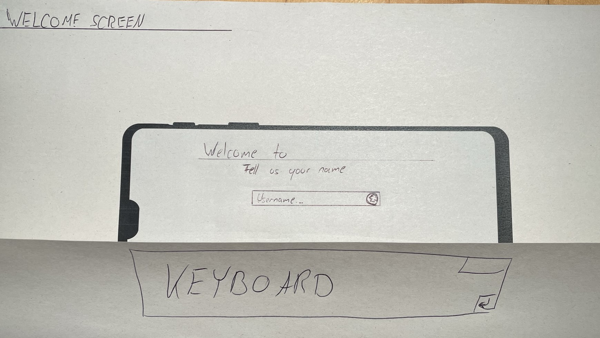
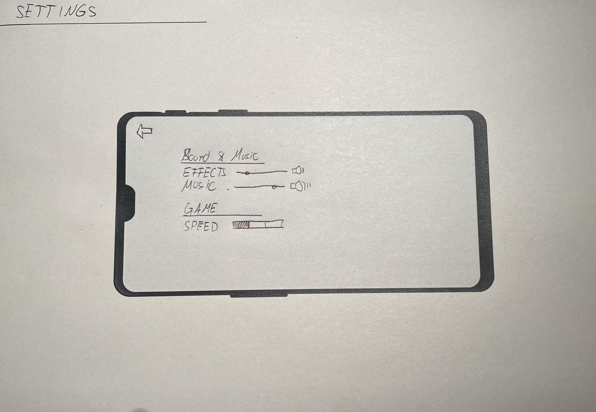
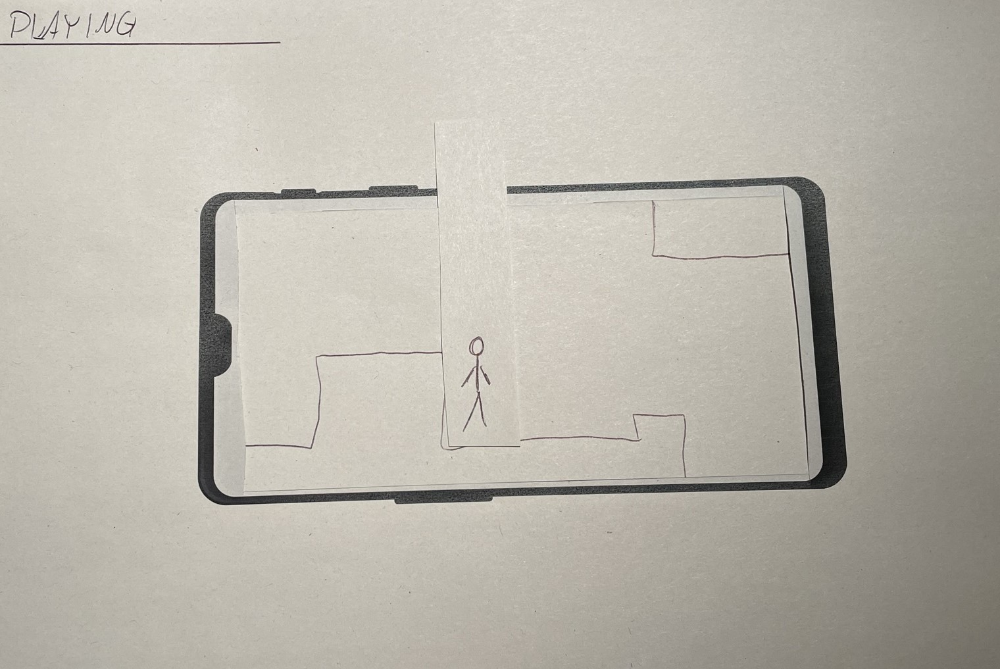
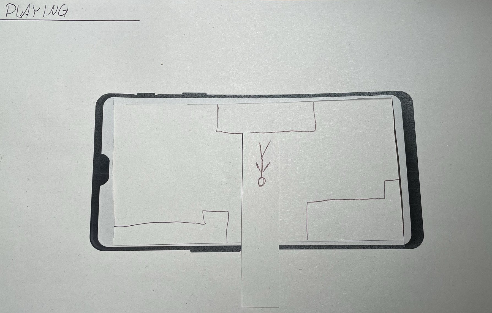

**Hauptmenü:** 

* Das Zahnrad-Symbol wurde für die Einstellungen verwendet, da es oftmals auch in anderen Bereichen für Einstellungen verwendet wird (external consistency)
* Call To Action mittels "Start to play" mittig um das Spiel schnell zu starten
* Leaderboard ist Listenartig und hat eine Scrollbar um die Möglichkeit des scrollens erkennbar zu machen.

**Username eingeben:**

* Das Eingabefeld verfügt über eine Bestätigung, ob ein Nutzername verwendet werden kann um Zeit zu sparen.
* zum Bestätigen wurde das Return-Symbol der Taste verwendet, da man es nach Eingabe der Nutzerdaten ohnehin drückt.
* die 3 Punkte und der Text "Username" symbolisieren, dass bisher kein Name eingegeben wurde. Somit lässt sich für den Nutzer erschlie0en, was erwartet wird.
* Die Tastatur ist die vom Android System verwendete Tastatur.
Da das Spiel ausschließlich im Landscape Modus verwendet werden soll. In diesem Modus sind aber Tastaturen traditionell über den gesammten Bildschirm.

**Einstellungen:**

* Der Zurück Button ist durch einen Pfeil in der linken oberen Ecke gekennzeichnet, da links angeordnete Elemente eher auf einen Rücksprung deuten.
* Die Lautstärke Einstellungen verfügen über ein kleines Piktogramm um die Lautstärke zu visualiseren. Die Slider ermöglichen genaue Einstellungen.

**Spiel aktiv:**

**Spiel pausiert:**

* Gleiche Setting wir normalen

**Spiel beendet:**

* Wie beim Pausebildschirm nur ohne Resume, da man ein verlorenes Spiel nicht weiterspielen kann.
* Highscore und aktueller Score werden zu einfacher Übersicht angezeigt.
