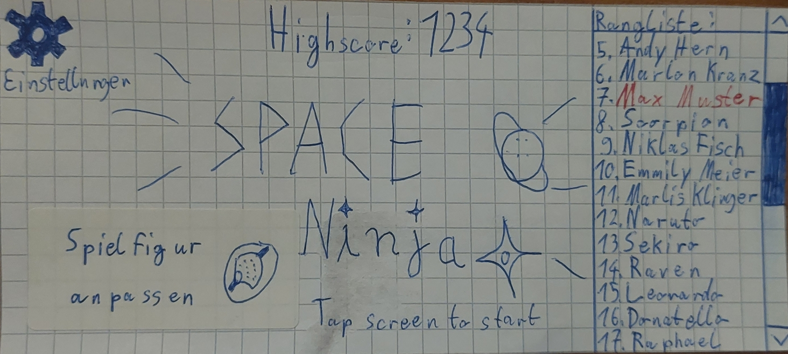
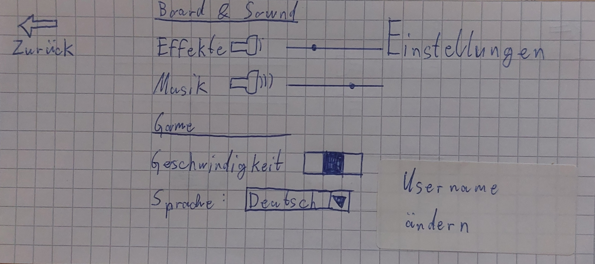
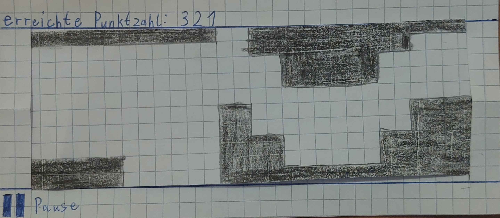
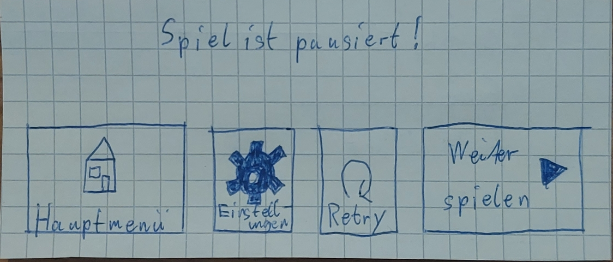
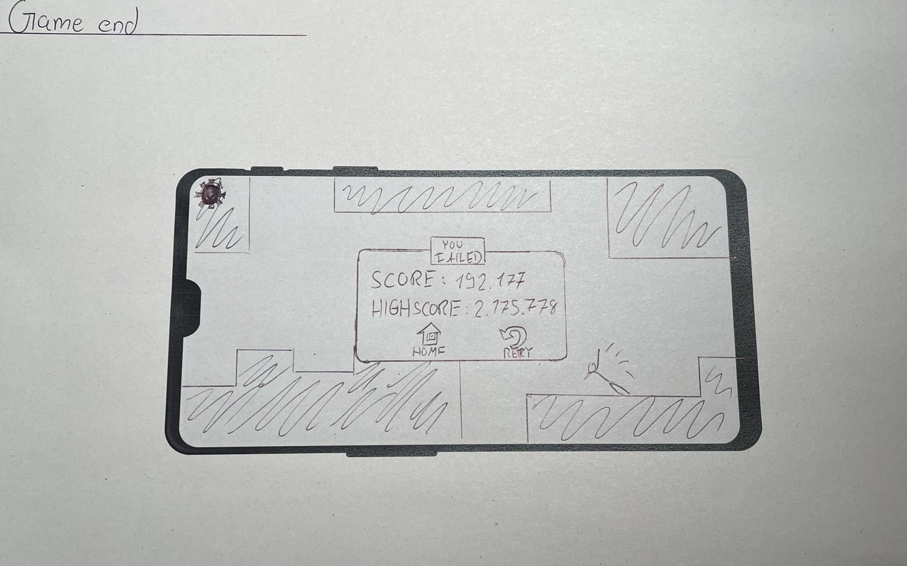

Der finale Prototyp ist eine Kombination der getesteten Prototypen und deren verbesserte Version. Es wurden die Screens ausgewählt die am besten performt haben bzw. es wurden zusätzlich noch die User befragt die die User Tests gemacht haben welche der Screens sie am besten finden.

**Hauptmenü:** 

**Skin Auswahl:**

**Username eingeben:**

**Einstellungen:**

**Spiel aktiv:**

**Spiel pausiert:**

**Spiel beendet:**

