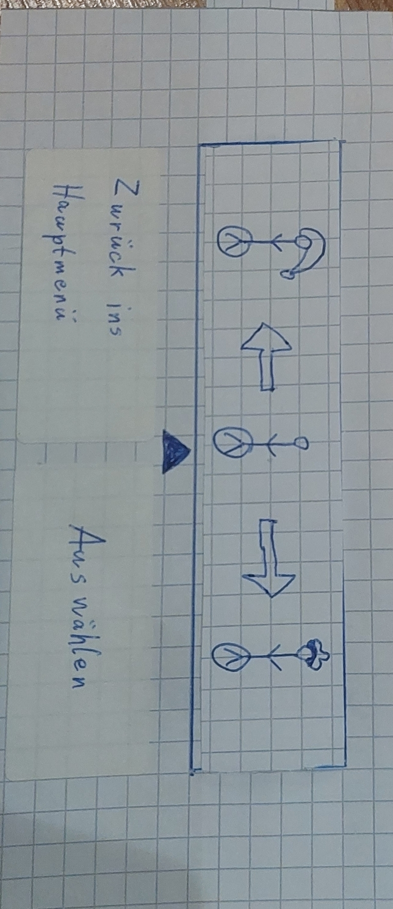

Der User Test wurde von Christian Schmitt mit der selben Person aus dem Interview für die Persona "Marlis Klinger" durchgeführt mit dem Prototyp aus "docs/Paper Prototypes/Paper Prototype chris.md"
Die Anwendungsfälle beginnen alle im Hauptmenü da dies das Fenster ist das beim starten der App zuerst erscheint.

1. Spiele das Spiel bis Game Over und kehre dann ins Hauptmenü zurück.

Marlis Klinger: Wahrscheinlich starte ich das Spiel mit dem Knopf da.
- Sie drückt auf den Button "Neues Spiel starten" und es öffnet sich das Fenster "aktives Spiel" und das Spiel geht los.

Marlis Klinger: Ah es geht schon direkt los.
- Sie drückt auf den Touchscreen und die Gravitation ändert sich.

Marlis Klinger: Huch jetzt laufe ich ja an der Decke.
- Kurz vor dem Abgrund an der Decke drückt Sie erneut auf den Touchscreen und die Gravitation ändert sich wieder auf den Boden
- Vor dem nächsten Hindernis drückt Sie wieder auf den Touchscreen und läuft an der Decke weiter.

Marlis Klinger: Das ist ja eine coole Idee dass man statt springen an der Decke weiterläuft.
- Sie spielt noch 3 Flächen weiter und fällt dann herunter also Game Over. Es öffnet sich das Popup "beendetes Spiel".

Marlis Klinger: Da habe ich wohl zu spät gedrückt. Die Aufgabe war ja dann ins Hauptmenü zurück zu gehen deshalb drücke ich darauf.
- Sie drückt auf den Button "Zurück ins Hauptmenü" und das Fenster "Hauptmenü" öffnet sich.

Marlis Klinger: So das war die Aufgabe

2. Ändere den Schwierigkeitsgrad des Spiels.

Marlis Klinger: Ich denke dass der Schwierigkeitsgrad eine Einstellung ist deshalb gehe ich davon aus dass ich Ihn in dort ändern kann. Bei diesem Zahnrad kam ich bei einer anderen App in die Einstellungen deswegen schätze ich dass ich damit dahin komme.
- Sie drückt auf das Zahnrad Icon und das Einstellungen Fenster geht auf.

Marlis Klinger: Ja da steht ja der Schwierigkeitsgrad, der steht jetzt auf Mittel.
- Sie drückt auf den Pfeil des Dropdown Menüs und es klappt sich auf. Sie drückt auf Leicht und das Dropdown Menü schließt sich wieder.

Marlis Klinger: So ich denke ich bin fertig mit der Aufgabe.

3. Ändere den Username der eingetragen ist.

Marlis Klinger: Also das klingt für mich auch wieder nach einer Einstellung deshalb gehe ich wieder dort hin.
- Sie drückt auf das Zahnrad Icon und das Einstellungen Fenster geht auf.

Marlis Klinger: Genau da steht der Username und da sehe ich auch einen Knopf zum ändern.
- Sie drückt auf den Button "Username ändern" und es erscheint das Popup Fenster "Username eingeben".

Marlis Klinger: Da über dem gräulichen Balken steht den Namen hier einzugeben klicke ich auf den grauen Balken.
- Sie drückt auf den grauen Balken (das Textfeld) und es erscheint die Smartphone Tastatur.
- Sie gibt Ihren Namen ein und klickt auf Bestätigen somit schließt sich das Popup Fenster und befindet sich wieder im Einstellungen Fenster. Da es ein Paper Prototype ist steht weiterhin Max Muster dort, aber es wird Ihr gesagt dass dort jetzt Ihr eingegebener Name stehen würde.

Marlis Klinger: Okay dann bin ich ja fertig mit der Aufgabe.

4. Ändere das Aussehen der Spielfigur.

Marlis Klinger: Das klingt auch schon wieder nach Einstellungen aber ich sehe hier auch einen Knopf Spielfigur anpassen deswegen drücke ich darauf.
- Sie drückt auf den Button "Spielfigur anpassen" und das Fenster "Spielfigur individualisieren" öffnet sich.

Marlis Klinger: Der in der Mitte ist bestimmt das aktuelle Aussehen weil da ein Pfeil drauf zeigt. 
- Sie drückt auf den rechten Skin aber es passiert nichts deshalb drückt sie noch ein paar mal drauf und wischt dabei auch einmal nach rechts. Nach dem wischen schiebt sich der Skin in die Mitte zu dem Pfeil. Das wischen war nicht beabsichtigt.

Marlis Klinger: Ich weis nicht genau warum ich mehrere Male draufklicken musste damit der andere ausgewählt wurde. Vermutlich muss ich das jetzt bestätigen mit dem Knopf Auswählen
- Sie drückt auf den Button "Auswählen".

Marlis Klinger: Ich bin fertig.

5. Starte das Spiel uns pausiere es, wenn es pausiert ist kehre ins Hauptmenü zurück.

Marlis Klinger: Also das Spiel hab ich ja schonmal gestartet bei der anderen Aufgabe deshalb weis ich schon wie es zu starten ist.
- Sie drückt auf den Button "Neues Spiel starten" und es öffnet sich das Fenster "aktives Spiel" und das Spiel beginnt.

Marlis Klinger: Ich weis nicht genau wie ich das Spiel pausiere aber das einzige was ich sehe wo in frage kommen könnte wäre das Ding links unten, da ja sonst nicht viele Icons oder Knöpfe zu sehen sind.
- Sie drückt auf das Pause Icon und das Popup Fenster "pausiertes Spiel" öffnet sich.

Marlis Klinger: Also war es dieses Icon, aber das war nur gerraten weil sonst nichts in Frage kam. So jetzt klicke ich noch auf Zurück ins Hauptmenü weil das ja die Aufgabe war.
- Sie drückt auf Zurück ins Hauptmenü und das Fenster "Hauptmenü" öffnet sich.

- zum pause icon noch Pause dazuschreiben
- zu einstellungen auch
- SPielfigur individualisieren noch hilfestellung durch pfeile

Erkenntnisse aus dem User Test:
- Das Pause Icon im aktives Spiel Fenster ist nicht für alle eindeutig.
- Im Fenster Spielfigur individualisieren war der Nutzerin nicht klar wie Sie den Skin wechseln kann, Sie hat es nur durch zufall geschafft.
- Insgesamt konnte sich die Nutzerin ohne Erklärung gut durch die Fenster navigieren, dass bedeutet es ist intuitiv bedienbar.
- Beim Gameplay des Spiels war sie am Anfang kurz überrascht dass sich die Gravitation geändert hat aber Sie hat schnell herausgefunden wie das Spiel funktioniert. 

Anpassungen:
- Neben das Pause Icon kommt noch der Text "Pausieren" für Eindeutigkeit des Icons.
- Neben das Einstellungen Icon kommt noch der Text "Einstellungen" für Eindeutigkeit des Icons. Dies wurde im Test zwar richtig erkannt dass es sich um Einstellungen handelt aber es könnte vorkommen dass ein anderer Nutzer dies nicht eindeutig erkennt so wie im Falle des Pause Icons.
- Im Fenster "Spielfigur individualisieren" wird noch eine Hilfestellung hinzugefügt in Form von Pfeilen nach links und rechts. (siehe folgende Skizze)

Die Nutzerin wurde anschließend gefragt ob die Anpassungen Ihr weitergeholfen hätten, dies wurde positiv beantwortet.

